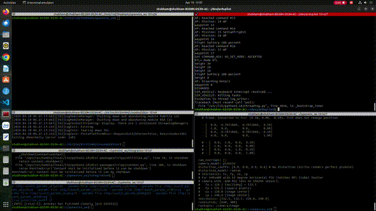

# AirSim-OpenVINS-ArduPilot Integration

A complete integration framework for Visual-Inertial Odometry (VIO) using AirSim simulation, OpenVINS estimator, and ArduPilot flight controller.

## Demo



## System Overview

```
AirSim (Unreal Engine) ←→ ArduPilot SITL (UDP)
                              ↓
                     ROS2 Bridge Node
                              ↓
                    OpenVINS (VIO)
                              ↓
                    ArduPilot (GPS injection)
```

## Components

| Component | Description |
|-----------|-------------|
| **AirSim** | Unreal Engine-based simulator with realistic sensor simulation |
| **ArduPilot SITL** | Software-in-the-loop flight controller simulation |
| **OpenVINS** | Multi-state constraint Kalman filter for visual-inertial odometry |
| **ROS2 Bridge** | Python node connecting AirSim APIs to OpenVINS topics |

## Repository Structure

```
├── airsim_openvins_bridge.py      # Single camera ROS2 bridge
├── airsim_openvins_bridge_dual.py # Dual camera ROS2 bridge
├── mavros_bridge_ardupilot.py     # MAVROS integration for ArduPilot
├── vio_to_ardupilot.py            # VIO pose to ArduPilot GPS injection
├── integration_launch.py           # Main launch script for full system
├── verify_integration.sh           # System verification script
├── openvins_airsim_config/        # OpenVINS configuration files
│   ├── estimator_config.yaml      # OpenVINS MSCKF parameters
│   ├── kalibr_imu_chain.yaml      # IMU calibration chain
│   └── kalibr_imucam_chain.yaml   # Camera-IMU calibration
├── scripts/                       # Utility scripts
│   ├── eval_plots.py             # VIO evaluation plots
│   ├── generate_vio_report.py     # VIO report generator
│   ├── vel_compare.py            # Velocity comparison tool
│   └── groundtruth_asl.csv       # Ground truth data (ASL format)
└── docs/                          # Documentation
    ├── SYSTEM_INTEGRATION_ARCHITECTURE.md
    ├── AIRSIM_SENSOR_CONFIGURATION.md
    ├── ARDUPILOT_SITL_SETUP.md
    ├── OPENVINS_PARAM_TUNING_GUIDE.md
    └── QUICK_TROUBLESHOOTING.md
```

## VIO Performance Results


Detailed analysis available in [vio-report.pdf](scripts/vio-report.pdf).

### Key Metrics

| Metric | Value |
|--------|-------|
| **Flight Duration** | ~7 minutes (417s) |
| **Position RMSE** | See PDF for full analysis |
| **Orientation Accuracy** | See PDF for full analysis |
| **Processing Rate** | 200 Hz IMU, 20-30 Hz camera |

## Setup & Installation

### Prerequisites

- Ubuntu 22.04 LTS
- ROS2 Humble Hawksbill
- AirSim (built from source)
- ArduPilot SITL
- OpenVINS

### Quick Start

```bash
# Clone and setup workspace
cd ~/openvins_ws
source /opt/ros/humble/setup.bash

# Launch AirSim first (in separate terminal)
cd ~/AirSim && ./AirSim.sh

# Launch the integration (from this repo)
python3 integration_launch.py
```

## Documentation

- [System Integration Architecture](SYSTEM_INTEGRATION_ARCHITECTURE.md)
- [AirSim Sensor Configuration](AIRSIM_SENSOR_CONFIGURATION.md)
- [ArduPilot SITL Setup](ARDUPILOT_SITL_SETUP.md)
- [OpenVINS Parameter Tuning Guide](OPENVINS_PARAM_TUNING_GUIDE.md)
- [Quick Troubleshooting](QUICK_TROUBLESHOOTING.md)
- [Testing Procedures](TESTING_PROCEDURES.md)
- [Complete Implementation Plan](COMPLETE_IMPLEMENTATION_PLAN.md)

## Bridge Nodes

### Single Camera Bridge (`airsim_openvins_bridge.py`)

Publishes:
- `/imu` - IMU data @ 200 Hz
- `/camera/image` - Camera images @ 20-30 Hz

### Dual Camera Bridge (`airsim_openvins_bridge_dual.py`)

Publishes:
- `/imu` - IMU data @ 200 Hz
- `/stereo/left/image` - Left camera @ 20-30 Hz
- `/stereo/right/image` - Right camera @ 20-30 Hz

### VIO to ArduPilot Bridge (`vio_to_ardupilot.py`)

Subscribes to:
- `/ov_msckf/odomimu` - VIO odometry from OpenVINS

Publishes:
- GPS coordinates to ArduPilot for position control

## Testing

```bash
# Run verification script
./verify_integration.sh

# Generate VIO report
python3 scripts/generate_vio_report.py

# Plot evaluation results
python3 scripts/eval_plots.py
```

## License

MIT License